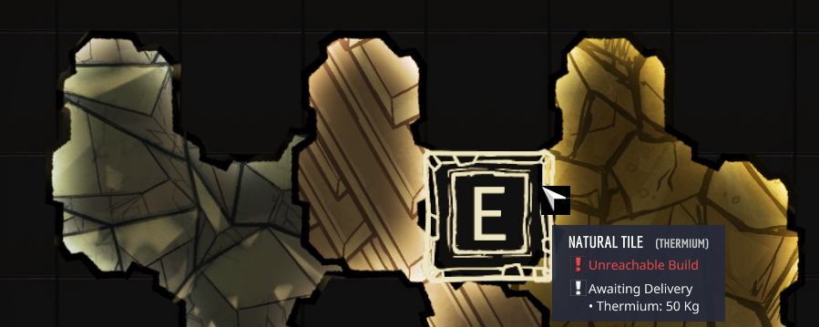

# BuildableNaturalTile

Allows building a natural elemental block.

# Features

- Elemental Blocks of all `Solid` elements.

# How To Use

1. Research Basic Farming
2. Build the tile like a normal tile.

# Current Limitations

- There is a net loss of 50% of the mass of the block if you dig them back up. (I personally feel this is part of balancing it, even if it's default ONI behavior)

# Known Issues

- Blocks can no longer be built on top of pickupables
- Blocks cause an error when building over certain tiles/blocks
- Blocks cause an error to randomly occur after a natural block is spawned

# Preview

